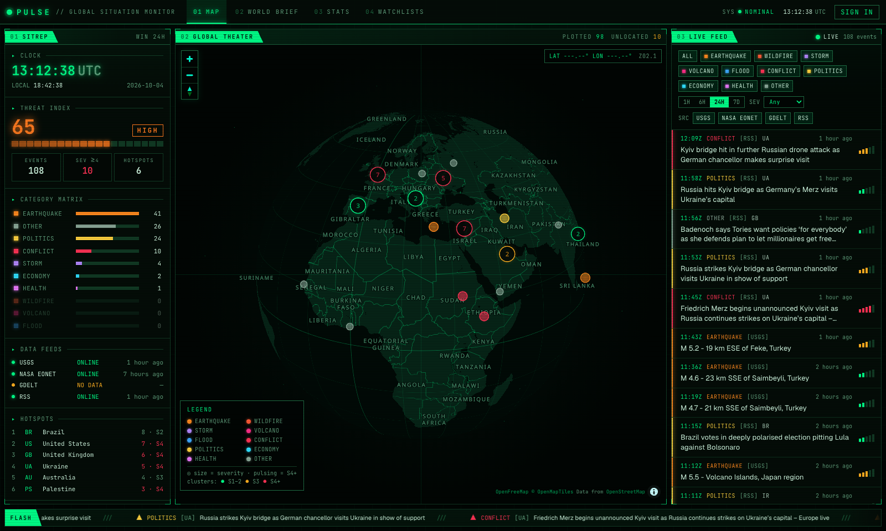
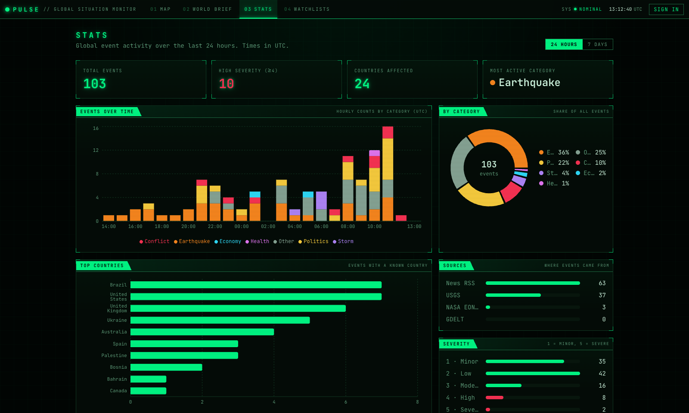

# PULSE — Global Situation Monitor

A real-time world events dashboard in a green-on-black "control room" style: earthquakes, wildfires, storms, volcanoes and world news, plotted live on a 3D globe, with a daily AI World Brief and personal watchlist alerts.

Inspired by [koala73/worldmonitor](https://github.com/koala73/worldmonitor). Built end to end with [Claude Code](https://claude.com/claude-code), using parallel sub-agents in separate git worktrees (see [How it was built](#how-it-was-built)).



## Features

- **3D globe** (MapLibre GL globe projection) that flattens into a street-level map as you zoom; clusters colored by severity, pulsing markers for severity 4+, fly-to, cursor lat/long readout
- **Live feed** over Supabase Realtime — new events appear without a refresh; filters for category, source, severity and time window live in the URL
- **SITREP panel** — UTC clock, threat index, category matrix, data-feed status, hotspots, priority traffic
- **Headline ticker** of the latest notable events
- **Stats** — events over time, by category, country, source and severity
- **World Brief** — a daily summary written by any OpenAI-compatible LLM (free tiers work), with an automatic extractive fallback when no key is set
- **Accounts, watchlists and alerts** — email/password or magic link; a Postgres trigger creates alerts when new events match your watchlists



## Stack (all free tier)

| Layer | Tech |
|---|---|
| App | Next.js 16 (App Router, Server Actions), React 19, TypeScript, Tailwind CSS v4 |
| Data | Supabase — Postgres + Row Level Security, Auth, Realtime, pg_cron |
| Map | MapLibre GL JS v6 + [OpenFreeMap](https://openfreemap.org) vector tiles (no API key) |
| Charts | Recharts |
| Tests | Vitest (unit), Playwright (e2e, desktop + mobile), GitHub Actions CI |
| Hosting | Vercel |

**Data sources:** [USGS Earthquakes](https://earthquake.usgs.gov/earthquakes/feed/) · [NASA EONET](https://eonet.gsfc.nasa.gov/) · [The GDELT Project](https://www.gdeltproject.org/) (15-minute event exports) · [GDACS](https://www.gdacs.org/) disaster alerts · [WHO Disease Outbreak News](https://www.who.int/emergencies/disease-outbreak-news) (© WHO, CC BY-NC-SA 3.0 IGO) · world news RSS from across the political spectrum (Guardian, HuffPost, Vox, NPR, Al Jazeera, BBC, DW, France 24, Crisis Group, Washington Times, Fox News, New York Post, plus Reuters, AP and Washington Examiner headlines via Google News), with each outlet's lean from [AllSides Media Bias Ratings](https://www.allsides.com/media-bias/ratings) · opt-in sports RSS (BBC Sport, Guardian, Sky Sports, ESPN). Headlines remain © their publishers and always link to the original.

## Architecture

```
pg_cron (every 10 min) ──POST /api/ingest──▶ ingesters (USGS, EONET, GDELT, RSS)
                                               │ fetchRaw → zod-validated normalize()
                                               ▼
                                   Postgres `events` (upsert on source+external_id)
                                     │                │ AFTER INSERT trigger
                        Supabase Realtime             ▼
                                     │          `alerts` for matching watchlists
                                     ▼
                     Browser: globe + live feed + SITREP (filters in URL)

pg_cron (daily) ──POST /api/brief──▶ select top events → LLM (or extractive) → `briefs`
```

- `lib/types.ts` — the shared `NormalizedEvent` contract every ingester outputs
- `lib/ingest/*` — one file per source, pure `normalize()` tested against saved fixtures
- `supabase/migrations/*` — schema, RLS policies, alert trigger, column grants
- `components/map/*` — MapLibre globe and the custom green vector style

## Local setup

```bash
npm install
cp .env.example .env.local   # fill in your Supabase URL/keys and a random CRON_SECRET
# apply supabase/migrations/*.sql to your Supabase project (SQL editor or `supabase db push`)
npm run dev

# pull data once by hand:
curl -X POST -H "Authorization: Bearer $CRON_SECRET" http://localhost:3000/api/ingest
curl -X POST -H "Authorization: Bearer $CRON_SECRET" http://localhost:3000/api/brief
```

```bash
npm run lint && npm run typecheck && npm test   # unit tests
npm run test:e2e                                # Playwright (builds + starts the app)
```

## How it was built

The project was built in phases with Claude Code, with independent modules developed **in parallel by sub-agents in isolated git worktrees**, then reviewed and merged by a lead agent:

1. **Foundation** — scaffold, shared types, Supabase clients, schema + RLS (sequential: it's the contract everything else builds on)
2. **Parallel build** — 4 agents at once: USGS+EONET ingesters · GDELT+RSS ingesters with geo/classify helpers · map + live feed · stats + brief pages
3. **Parallel build** — 3 agents: auth + watchlists + alert trigger · AI brief generator · Playwright e2e + CI
4. **Research agent** — compared free 3D globe options (MapLibre, globe.gl, deck.gl, Cesium) before the map was swapped
5. **Security review agent** before going public

Module ownership per agent is documented in [`CLAUDE.md`](CLAUDE.md).

## License

[MIT](LICENSE)
